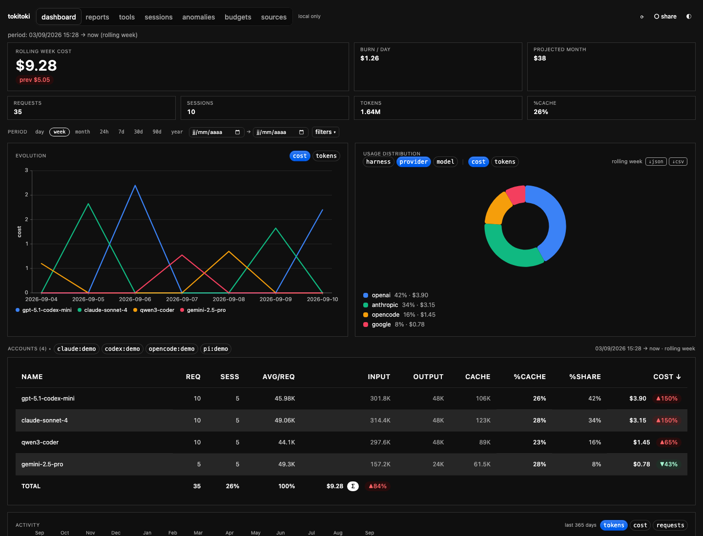
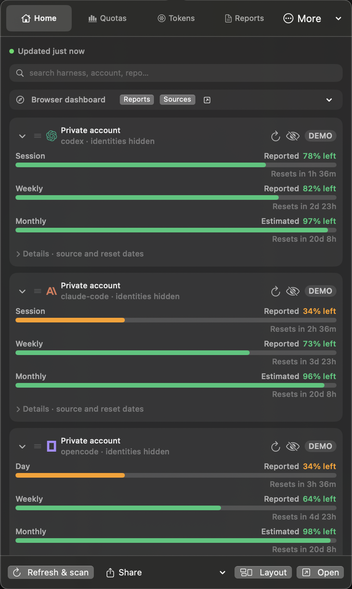
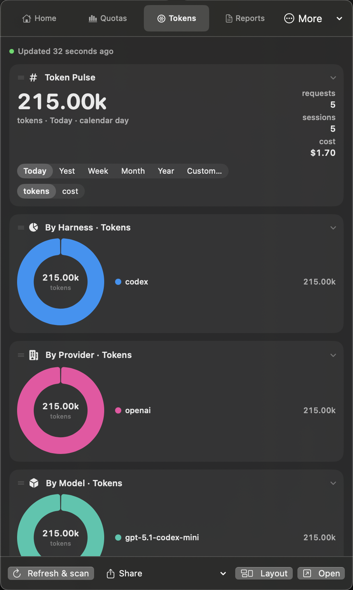

# tokitoki

> Local-first usage analytics for coding agents.

Tokitoki scans local harness stores, normalizes usage into one deduplicated
event log, and gives you the same picture in a CLI, web dashboard, native
macOS menu bar, shell widgets, and MCP. It is designed for people who use
multiple agents, accounts, machines, or all three.

<p align="center">
  
</p>

<p align="center">
  
  
</p>

<p align="center">
  <a href="#quick-start">Quick start</a> ·
  <a href="#what-you-get">What you get</a> ·
  <a href="#supported-harnesses">Supported harnesses</a> ·
  <a href="#privacy-and-data">Privacy and data</a>
</p>

## What you get

- **One local history** across Claude Code, Codex CLI, pi, OpenCode, Gemini
  CLI, Grok CLI, and other indexed harnesses.
- **Useful dimensions**: model, provider, account, project, repository,
  machine, tool, and time window.
- **Honest cost and quota views**: native provider costs when available,
  pricing-based estimates where needed, and clearly labelled plan gauges.
- **Multiple surfaces**: composable CLI reports, a local browser dashboard, a
  macOS menu-bar app, host-neutral shell widgets, and an MCP server for agents.
- **Multi-machine deduplication**: sync append-only event files without
  counting the same session twice.
- **Explicit sharing**: usage stays local unless you configure sync or opt in
  to publishing an aggregate report.

## Quick start

For a packaged run with Nix:

```sh
nix run github:astahmer/tokitoki -- --version
nix run github:astahmer/tokitoki -- scan
```

For a checkout:

```sh
git clone https://github.com/astahmer/tokitoki.git
cd tokitoki
bun install

bun src/cli.ts scan
bun src/cli.ts report --last week --by provider
bun src/cli.ts web                 # local dashboard at http://localhost:7788
```

The first scan reads the provider stores already present on your machine. A
new install with no supported harness data simply reports an empty window.
Nothing needs to be uploaded to use the CLI or local dashboard.

## Privacy and data

Tokitoki is local-first: the normalized log and cache live under
`~/.local/share/tokitoki` by default, and the browser server binds locally.
Provider account emails are hidden unless you explicitly enable the
`--show-email`/dashboard toggle. Sync backends, public aggregate sharing, and
optional pricing refreshes are opt-in configuration choices.

To inspect exactly which local stores were discovered:

```sh
bun src/cli.ts sources
```

## Architecture sketch

- Each machine: local scanner writes normalized JSONL append-log
  (`~/.local/share/tokitoki/events.jsonl`) + sqlite cache
- Sync layer: pluggable — Syncthing dir first (zero infra), restic/R2 as backup
- Aggregation: merge all synced logs, dedupe on identity key, aggregate in
  sqlite; totals are pure functions of the merged log
- Store format: append-only, conflict-friendly (Syncthing-safe: last-writer
  wins per line, no mutable DB as sync unit)

## Design principles

- Prefer provider-reported cost and token data; make pricing-based estimates
  visible when a harness only exposes cumulative usage.
- Treat subscription limits as configured gauges, not invented provider truth.
- Keep ingestion incremental and append-only so scans are cheap and sync is
  conflict-friendly.
- Make every surface consume the same normalized event and widget contracts.

## Development setup

The repository includes a Nix dev shell and direnv entrypoint. With
[Nix](https://nixos.org/) and [direnv](https://direnv.net/) installed:

```sh
direnv allow
# entering the directory installs dependencies from bun.lock automatically
# and puts the source `tokitoki` shim on PATH

# run ad hoc:
bun src/cli.ts scan
tokitoki scan
```

The shell provides Bun, pnpm, Git, jq, ripgrep, and (on Darwin) Swift for the
native menu-bar target. Set `TOKITOKI_SKIP_INSTALL=1` to enter without running
the dependency install hook. The `bin/tokitoki.js` source shim is available as
`tokitoki` while the directory is active; no global install is needed for CLI
development.

## Installation

### Nix

The root flake provides a source-built `tokitoki` package for Linux and macOS
(Intel and Apple Silicon). It can be used directly without direnv:

```sh
nix run github:astahmer/tokitoki -- --version
nix build github:astahmer/tokitoki#tokitoki
```

To install it through Home Manager, add the repository to your flake inputs:

```nix
inputs.tokitoki.url = "github:astahmer/tokitoki";
```

Then either install the package directly:

```nix
home.packages = [ inputs.tokitoki.packages.${pkgs.system}.default ];
```

Or use the provided Home Manager module:

```nix
imports = [ inputs.tokitoki.homeManagerModules.default ];
programs.tokitoki.enable = true;
```

The Nix package builds the CLI and web assets ahead of time and includes its
Bun runtime. The installed command does not need `node_modules`, Bun, or
network access at runtime. It also installs the shell adapter files under
`<tokitoki-store-path>/share/tokitoki/integrations`. direnv remains available
separately for repository development through the `devShells` output.

### Shell integrations

Shell integrations consume the same versioned JSON payload as the native
apps instead of reimplementing provider parsing:

```sh
tokitoki scan
tokitoki widget-payload --cached --json
```

For the first DMS test, from a checkout:

```sh
mkdir -p ~/.config/DankMaterialShell/plugins
ln -sfn "$PWD/integrations/dms/tokitoki" \
  ~/.config/DankMaterialShell/plugins/tokitoki
dms ipc call plugins reload tokitoki
```

Then enable `Tokitoki Usage` in DMS Settings → Plugins and add it to DankBar.
The remaining experimental adapters and their host-specific installation notes
are documented in [`integrations/README.md`](integrations/README.md). The
adapter source is intentionally kept separate from the host-neutral contract,
so the same data can be reused by DMS, Noctalia, Quickshell, Plasma, Waybar,
GNOME, and COSMIC.

## Publishing

```sh
pnpm pack            # runs prepack: tests + typecheck + build (SPA + bundled CLI)
npm publish          # ships bin/ shim + dist/cli.js + dist/web assets
```

The package is bun-only (`engines.bun`): `dist/cli.js` is a `bun build
--target=bun` bundle, and the SPA is baked into the tarball so installed
copies never need node_modules or a web build. The `bin/tokitoki.js` shim
prefers the built CLI and falls back to `src/cli.ts` in unbuilt checkouts.
Verify a tarball before publishing:

```sh
tar -xzf tokitoki-*.tgz -C /tmp && bun /tmp/package/bin/tokitoki.js --version
```

## Usage

```sh
tokitoki scan                       # incremental scan of all providers
tokitoki scan --provider pi         # one provider (pi | claude-code | codex)
tokitoki today                      # today's usage grouped by model
tokitoki report --last week --by account
tokitoki report --last week --show-email --by account  # name <email> rows
tokitoki report --last month --json # machine-readable
tokitoki grid --last year [--metric tokens|cost|requests]  # calendar heatmap

# Claude 5-hour billing blocks (ccusage semantics) + active-block gauge
# ▸ marks the active block; gauge = elapsed fraction, countdown to reset
tokitoki blocks [--last day] [--account <key>]

# One-line statusline for editor hooks (reads Claude Code stdin JSON):
#   <model> · $<sess> sess · $<today> today · $<MTD> MTD · block <n>% (<m> left)
# register: {"statusLine":{"command":"bun /path/to/tokitoki/src/cli.ts statusline"}}

# sort by any column, filter by provider (repeatable), toggle Δ vs previous period
tokitoki report --last week --by model --sort cost        # default order: cost desc
tokitoki report --last week --sort %cache --asc
tokitoki report --last week --provider pi --provider codex
tokitoki report --last week --no-delta                   # Δ on by default

# ASCII visuals + evolution over time
tokitoki chart --last month                 # daily token bars
 tokitoki chart --last week --spark          # compact sparkline
tokitoki chart --last month --by provider --spark   # one sparkline per provider
tokitoki pie --by model                     # share-of-tokens legend with cost bars

tokitoki budgets                            # [budgets] gauge state (day/week/month caps)
tokitoki budgets --json                     # menubar/web contract: [{scope,label,cap,used,unit,ratio,state,daysLeft}]
tokitoki widget-payload --cached --json     # shared native-app/shell payload
tokitoki sources                            # provenance: store paths, files/events scanned, accounts, models per provider
```

Table output uses letter-suffixed numbers (`1.71B`, `23.7M`), `%cache`
(cache share of prompt tokens), a `%share` column (share of cost — falls
back to token share when every row costs $0), `sess` (distinct sessions) and
`avg/req` (tokens per request) columns, human costs, and a TOTAL row.
Sortable columns: `name | requests | sessions | avg | input | output | cache |
%cache | cost`.

When `--delta` is on (default for `report`), each cost cell carries `▲/▼`
vs the equally-sized previous window (`▲` green / `▼` red on TTYs;
`▲new` = bucket absent last period).

`today` and `report --last month` end with a burn line:
`burn: $X.XX/day → projected $Y by month end` (request-based when all costs
are $0). `today` also lists the top-3 projects month-to-date.

Dimensions: `model | project | account | machine | provider`.
Periods: `day` = local calendar day; `week`/`month` = rolling 7/30 days.

Multi-machine merge: sync `~/.local/share/tokitoki/events.jsonl` between Macs
(e.g. Syncthing) and list the other machines' files in
`~/.config/tokitoki/config.json`:

```json
{
  "extraEventFiles": ["~/syncthing/tokitoki-other-mac/events.jsonl"],
  "providers": { "pi": { "paths": ["/custom/pi/sessions"] } },
  "plans": {
    "codex-work": { "kind": "subscription", "monthlyRequestCap": 30000 },
    "opencode-*": { "kind": "subscription", "monthlyCostCap": 200 }
  }
}
```

Events dedupe on a stable id `(provider, accountKey, sessionId, entryId)` —
the same session synced to two machines counts once.

## Sync (cross-machine)

`tokitoki sync [--backend dir|git|atproto] [--push|--pull|--both]` moves
normalized events between machines. Backend + connection come from `[sync]`
in config.toml:

### dir — Syncthing folder (zero infra)

```toml
[sync]
backend = "dir"
path = "~/Sync/tokitoki"   # one <machineId>.jsonl per machine, no conflicts
```

Each machine writes only its own file; pull reads everyone else's. Point your
Syncthing shared folder at that path on both Macs and run `tokitoki sync` on
each (or a launchd/cron job hourly).

The same backend works with iCloud Drive when both Macs share one iCloud
account. Use a per-user folder such as
`~/Library/Mobile Documents/com~apple~CloudDocs/tokitoki`; Tokitoki expands the
leading `~`, gives each machine its own JSONL file, and only transfers new
bytes after the first push. Never place `cache.db` or its WAL files in the
shared folder.

### git — private repo

```toml
[sync]
backend = "git"
url = "git@github.com:you/tokitoki-events-private.git"
branch = "main"
```

Push = commit this machine's file + push; pull = fetch + read other machines'
files. Works with any private git host; auth is whatever your ssh-agent/
credential helper already has.

### atproto — scaffold (lexicon unpublished)

```toml
[sync]
backend = "atproto"
pds = "https://bsky.social"      # or cirrus/your PDS
handle = "you.bsky.social"
# app password via TOKITOKI_ATPROTO_APP_PASSWORD env (preferred) or appPassword here
```

Stores one record per event under `tokitoki.<handle>.usage`. ⚠️ Guarded behind
`--sync-atproto`: the lexicon is NOT published yet and the nsid embeds a handle
label, so strict PDS validation may reject writes until a real lexicon is
registered.

Pulled lines land in `~/.local/share/tokitoki/remote-events.jsonl` — never in
your local log — and merge into every report through the normal dedupe path,
so re-pulling identical lines is always a no-op.

### Plan gauges (honest approximation)

Rows whose accountKey matches a `plans` pattern (exact or trailing `*`) show
a month-to-date usage gauge instead of a cost cell — most useful with
`--by account`. Providers don't expose subscription quotas, so caps are
user-configured estimates; the gauge is only as honest as the cap you set.

- Tests + runner are Bun-native (`bun test`, imports from `bun:test`); sqlite is `bun:sqlite`
## Web dashboard

```sh
bun run web:build       # vite build → dist/web/  (required once)
tokitoki web            # → http://localhost:7788  (--port to change)
bun run web:dev         # vite dev server :5177, /api proxied to :7788
```

React + TypeScript SPA built with Vite, styled with Cloudflare Kumo and
Tailwind CSS v4, with charts via **TanStack Charts** (line timeseries + polar
donut).

Build flow:

```text
web/src (React+TW) ──vite build──▶ dist/web/ ──Bun.serve static──▶ browser
                                        ▲
src/web/api.ts ◀── same aggregation as the CLI (EventCache) ── /api/* JSON
```

- `Bun.serve` (src/web/server.ts) serves `dist/web/` statically and keeps
  `/api/*` JSON endpoints; if `dist/web/` is missing it returns a helpful
  "run bun run web:build" message. No duplicated SQL: API responses come
  from the exact CLI aggregation in src/web/api.ts.
- Parity with the CLI: period + group-by tabs (incl. repo), provider filter
  chips, multi-account tabs, click-to-sort table (%share, %cache, Δ vs
  previous window, plan gauges), evolution chart, donut share, and a
  GitHub-style calendar heatmap (`/api/grid`, metric switchable; the same
  grid exists on the CLI as `tokitoki grid`).
- Account emails: providers expose the logged-in address read live from
  local harness stores (claude-code → ~/.claude.json oauthAccount;
  codex → JWT payload in ~/.codex/auth.json; pi/opencode are key-only →
  null). Toggle "show emails" in the web UI (persisted to localStorage) or
  pass `--show-email` to `report`.

## Docs

- [Publishing the ATProto lexicon](docs/atproto-lexicon.md) — NSID choice,
  schema doc, hosting/announcement, versioning rules, adapter flip checklist
- [Packaging](docs/packaging.md) — source-first run model (compiled-binary flow removed 2026-08-25),
  historical cross-compile/release notes, nix packaging recipe
- [Menu-bar app](menubar/tokitoki-menubar/) — native SwiftUI MenuBarExtra
  (macOS 13+), `swift build`, refreshes every 5 min from the compiled CLI

## MCP server

`tokitoki mcp` (stdio, local-only — no port, no daemon) exposes the CLI's
reporting surface as MCP tools: `usage_report`, `usage_totals`,
`sessions_top`, `session_detail`, `tool_spend`, `repo_efficiency`,
`budgets_status`, `quota_snapshot`, `anomalies`, `sources`, `scan_now`,
`export_report`. Window flags map 1:1 to CLI semantics (`last`: day|week|month
or durations like `24h`). Register it in your client:

```jsonc
// claude / codex / generic mcp config
{
  "mcpServers": {
    "tokitoki": {
      "command": "bun",
      "args": ["/path/to/tokitoki/src/cli.ts", "mcp"]
      // or the compiled binary: { "command": "/path/to/dist/tokitoki", "args": ["mcp"] }
    }
  }
}
```

## Menu-bar app

Start/stop the native app from the CLI (macOS Swift app today; Electrobun
port tracked in plans/linux-menubar.md):

```sh
tokitoki menubar            # start (idempotent; launchctl-aware on macOS)
bun run menubar             # rebuild Swift + restart the launchd app from this checkout
bun run menubar:restart     # explicit alias for the same source-first flow
tokitoki menubar --status   # pid + running state
tokitoki menubar --stop     # stop (launchctl bootout when plist present)
tokitoki menubar --foreground   # attached, logs to stdout
```

Binary resolution mirrors the app's own CLI lookup in reverse:
`$TOKITOKI_MENUBAR_BIN` → repo build → `~/bin/tokitoki-menubar`.

The Settings tab's **Open config file** button opens the active configuration
source. By default this is `~/.config/tokitoki/config.json`; if JSON is absent
and `config.toml` exists, TOML remains the writable source so UI changes do
not create a drifting JSON sidecar. UI setters also accept an explicit
`TOKITOKI_CONFIG=/path/to/config.toml` override. `tokitoki config --json` is a
read-only machine-readable view of the effective file.

## Backfill imports

`tokitoki import <file.csv> [--source anthropic|openai|openrouter] [--dry-run]`
merges provider console exports into your history. Source is auto-detected
from headers; rows are deduped by a stable content hash so re-importing the
same file never double-counts. Events are attributed to provider
`<source>-import` and account `imported`.

Expected column shapes (header names matched fuzzily, case-insensitive):

| source | needs | notes |
|---|---|---|
| anthropic console | timestamp, model, input/output/cache tokens, cost | per-request rows; `Transaction ID` present |
| openai usage | date, model, token columns | aggregated daily rows → one event each |
| openrouter activity | timestamp (UTC), model, prompt/completion tokens, cost | `Provider` column present |

Unparseable rows (bad dates, zero tokens) are counted as skipped, never fatal.

## Budgets + ntfy alerts

```toml
[budgets]
daily = 10      # USD caps, global
monthly = 200
ntfy = "https://ntfy.sh/your-topic"   # optional push on threshold crossing

[budgets.accounts."codex*"]           # accountKey pattern (trailing * = prefix)
monthly = 120
```

After every scan/report/today, burn vs caps is checked at 80% and 100%.
Crossings print a ⚠ banner and POST to the ntfy topic. Alerts dedupe per
(scope, period, pattern, threshold) in `<data-dir>/alerts.json` — a threshold
fires once per period.

### Menu-bar integration

`tokitoki budgets --json` is the menubar contract. The SwiftUI app
(`menubar/`) polls it on the same 5-min timer as its reports and adds:

- **title badge**: 🟠 when any budget ≥80%, 🔴 when any exceeded (emoji dots —
  the macOS status bar renders SF symbols monochrome)
- **Budgets section**: per-cap `ProgressView` tinted by state + `$used / $cap`
  + days left in the period (hidden entirely when no `[budgets]` config)
- **anomaly row**: top flagged day from `tokitoki anomalies --json`, if any
- **native notifications** on threshold *crossings* (not while staying past
  one), deduped per period in `<data-dir>/menubar-state.json` so a restart
  never re-notifies; bare LaunchAgent builds use macOS's local notification
  bridge when a bundle identifier is unavailable
- **critical quota alerts** when a provider reports a configured amount of
  remaining capacity, plus a reset notification when an exhausted window
  becomes available again; observations survive restarts in
  `<data-dir>/menubar-quota-state.json`
- **spend guard** in Settings: month-to-date spend, daily burn rate, projected
  month-end spend, and warning/exceeded state against `[budgets].monthly`
- **actionable usage side-notch**: the edge rail can run in Quota, Activity,
  or Runway mode. Hovering a provider shows its remaining windows plus compact
  actions to refresh, fix login/API-key access, open the provider console, or
  jump to its latest indexed session. Activity is intentionally labelled as
  indexed/recent activity rather than pretending to be a live provider hook.
- **attention state on the rail**: providers that need login or an API key get
  an orange badge and an explicit recovery action; right-clicking a provider
  exposes the same actions without opening the popover.

Menubar notification preferences are stored in a top-level `[notifications]`
section:

```toml
[notifications]
enabled = true
resetAware = true
quotaCriticalPercent = 10
burnWarnings = true
burnWarningRatio = 0.8
```

The side-notch is configured independently from the menubar preview:

```toml
[ui]
sideNotchEnabled = true
sideNotchMode = "runway"       # quota | activity | runway
sideNotchMetric = "smart"      # percent | tokens | smart
sideNotchWindow = "smart"      # smart | day | week | month
sideNotchPlacement = "right"   # any of the 12 perimeter anchors
```

`sideNotchSyncPreview = true` mirrors the preview's enabled state, provider
visibility, and metric when that is more convenient. The notch's mode and
placement remain independent so the two surfaces can serve different jobs.

## Pricing data

Model prices auto-sync from LiteLLM's community pricing JSON into
`<data-dir>/pricing.json` (7-day TTL, 1h retry throttle when offline). The
embedded snapshot is the offline fallback. Unknown models estimate as $0 with
a one-time stderr note.

## Supported harnesses

| Provider | id | Status | Store | Notes |
|---|---|---|---|---|
| Claude Code | `claude-code` | ✅ working | `~/.claude/projects` JSONL | tokens + tools + emails |
| pi | `pi` | ✅ working | `$PI_DIR/agent/sessions` JSONL | tokens, cost reported by harness |
| Codex CLI | `codex` | ✅ working | `~/.codex/sessions` JSONL | delta-usage rollouts, best effort on unknown shapes |
| opencode | `opencode` | ✅ working | `$XDG_DATA_HOME/opencode/opencode*.db` SQLite | request-level tokens+cost from assistant messages; watermark cursor on `message.time_updated`; legacy WAL stores opened via immutable fallback; sessions searchable (title + text parts) |
| T3 Code | `t3code` | ◐ indexed only | `~/Library/Application Support/t3code/IndexedDB/*.leveldb` | threads searchable (titles/prompts); store exposes **no token usage** |
| Antigravity CLI | `antigravity-cli` | ◐ provenance only | `~/.gemini/antigravity-cli/conversations/*.db` | protobuf blobs; no usage exposed |
| Cursor | `cursor` | ◐ indexed only | `state.vscdb` + `ai-tracking/ai-code-tracking.db` | transcripts/summaries searchable; **no token counts in any inspected store** (199k activity-hash rows verified) |
| Grok CLI | `grok` | ✅ working | `$GROK_HOME/sessions/**/*.jsonl` | tolerant codex-family parser (`last_token_usage` deltas preferred, flat `usage` spellings accepted) |
| Gemini CLI | `gemini-cli` | ✅ working | `~/.gemini/tmp/<hash>/chats/session-*.json` | per-message `tokens` objects when stats are recorded; sessions without them stay search-only |
| Aider | `aider` | 📐 skeleton | `.aider.chat.history.jsonl` per repo | needs per-repo discovery |
| Goose | `goose` | 📐 skeleton | `~/.config/goose/sessions` JSONL | — |
| Amp | `amp` | 📐 skeleton | `~/.local/share/amp/threads` JSON | — |
| Zed | `zed` | 📐 skeleton | `~/.local/share/zed` sqlite | schema needs inspection |

All providers honor a per-provider `paths` config override plus the env var
shown by `tokitoki sources`. Skeletons emit no events until their store exists
and a real adapter replaces them.

## Status / known limits

- Codex provider is best effort (format observed on codex 0.146.x); unknown
  line shapes are skipped
- Cost for models missing from the pricing table estimates to $0
- `report` rebuilds the sqlite cache lazily when log/event counts diverge;
  very large logs may want a faster merge strategy later

## Roadmap

The core ingestion and reporting loop is usable today. The next improvements
are deliberately incremental:

- richer provider quota coverage and reset-aware polling
- a more visual request timeline in session details
- keyboard-first and narrow-viewport polish for the dashboard
- additional harness adapters and deeper indexed-session support
- a Linux-native menubar target alongside the existing macOS app

## Prior art

- <https://github.com/ccusage/ccusage>
- <https://github.com/steipete/CodexBar>
- openusage.ai

## Changelog

### v0.4.0
- sessions page: FTS5 search across every harness, snippet highlights,
  filter rail; `tokitoki sessions --search`
- harness coverage: t3code/antigravity indexed (provenance), skeletons +
  supported-matrix for cursor/grok/gemini-cli/aider/goose/amp/zed
- tool-level cost attribution (`--by tool`, treemap mosaic in web, top
  tools in menubar) — token-cost inspired
- budgets: `tokitoki budgets init` seeds per-account caps from detected
  accounts; ntfy push at 80%/100%
- multi-machine presence: `.hb` heartbeats on sync push, machines strip
  in Sources tab + `tokitoki presence`, menubar active-machines line
- explicit period headers everywhere; duration ranges (`--last 24h`,
  `--from/--to` ISO); `-v`; exports json/md/csv
- light/dark theme with proper heatmap ramp contrast (light mode fixed)
