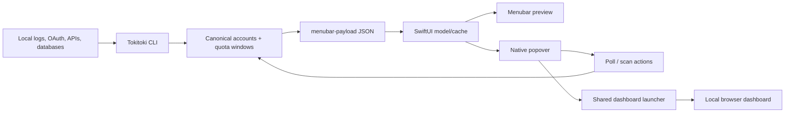
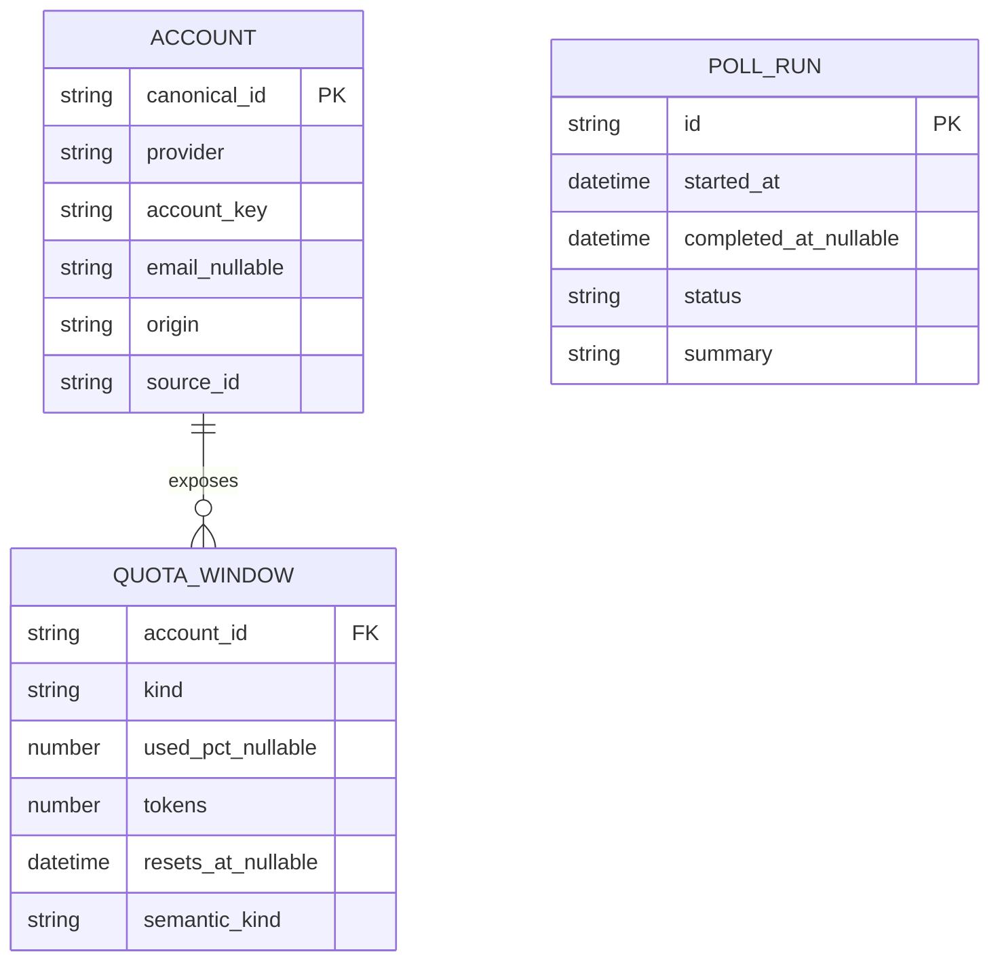

# Menubar UX release plan

## Context

- TokiToki is a native macOS menubar app backed by the existing `menubar-payload --json` contract and a local web dashboard.
- The popover is a fixed 380×620 SwiftUI surface with native Home, Quotas, Reports, Sources, and Settings subviews.
- Home currently combines freshness, search, a dashboard handoff row, configurable analytics cards, quota cards, and a sticky footer.
- Quota cards can contain provider-reported windows or scan-derived relative estimates. Account identity is `provider@accountKey`, with optional email, plan, origin, and credential hint.
- Background quota polling is opt-in and configurable through `poll.enabled` and `poll.intervalMinutes`; local payload refresh and provider polling are separate operations.
- Existing related work: [menubar UI review](menubar-ui-review.md), [menubar command plan](menubar-command.md), [quota findings](quota-windows-findings.md), and [competitive analysis](competitive-analysis.md).
- Inspiration: OpenUsage's starred metrics and provider-aware dashboard, CodexBar's configurable menu-bar tokens and provider drill-in, and token-cost's explicit distinction between exact totals and estimated attribution.

## Goal

Make the menubar app immediately useful for deciding whether work can continue, while keeping deeper usage, source provenance, and configuration discoverable without clutter.

The finished release must have a coherent footer, truthful quota/polling semantics, stable account identity, responsive navigation, accessible states, and a verified deployment path.

## What

Implement one cohesive menubar UX release covering:

- A compact, non-duplicated footer and dashboard handoff.
- Clear native subview information architecture.
- Explicit polling state, cadence, next-run, last-result, and error feedback.
- Stable provider/account identity and regression tests for personal/work and Copilot duplicates.
- Inline estimated-versus-provider-reported quota semantics.
- Smart menubar preview behavior for exhausted and governing quota windows.
- Useful Home attention summaries and richer Reports/Sources surfaces.
- Fast initial rendering, non-blocking tab changes, and scoped refresh feedback.
- Accessibility, copy, localization, dark/light mode, and visual-regression coverage.
- Rebuild/restart/deploy verification through the package script and live launchd app.

## Why

The app has grown from a compact usage indicator into a multi-provider quota and analytics tool. The current surface now exposes valuable data, but the hierarchy is unclear: the footer duplicates dashboard navigation, polling is difficult to understand, estimated bars resemble real limits, and dense cards compete with their own controls.

The menubar is most valuable when it answers two questions quickly:

1. Can I use this provider/account now?
2. If not, what is the relevant constraint and when does it recover?

Everything else should support those answers progressively rather than competing with them.

## How

### Conceptual model

```text
Menubar preview
  └─ compact status: selected providers, governing constraint, stale/error signal

Popover
  ├─ Home     → attention summary + most relevant quota cards + quick links
  ├─ Quotas   → all accounts/windows, with provenance and reset semantics
  ├─ Reports  → spend/tokens/requests/trends and drill-down
  ├─ Sources  → local sources, scans, polling health, credentials, errors
  └─ Settings → polling, popover layout, preview, privacy, lifecycle

Browser dashboard
  └─ deeper reports/source views, launched through one on-demand server path
```

### Operations / behavior

- Opening the popover shows cached last-good data immediately, then refreshes asynchronously.
- Home displays a compact “Needs attention” summary only when a quota is exhausted, low, stale, or errored.
- Dashboard links have one canonical location in Home; Reports and Sources do not repeat links to themselves.
- The footer is a compact utility toolbar with Refresh all, Share, Layout, and one browser handoff where needed.
- “Refresh all” refreshes the payload; “Refresh quotas” polls providers; “Refresh provider” is used for card-level provider refreshes.
- Polling settings show Off/On, cadence, next check, last check, result, and failures.
- Polling failures retain the last successful values and show an actionable inline error.
- Quota rows state whether a value is provider-reported, scanned, relative, estimated, or unavailable.
- Account identity remains stable across refreshes and source-order changes.
- Copilot sources are canonicalized and deduplicated before payload serialization; tests assert one card per logical account/source.
- Smart preview chooses the most relevant governing window and reset countdown, while preserving explicit user controls for hiding exhausted providers.
- Browser dashboard links all use the shared on-demand launcher and report startup failure clearly.

### Tech choices

| Choice | Decision | Rationale |
|--------|----------|-----------|
| Native popover navigation | Keep SwiftUI subviews | The current tab model is already native and switches synchronously. |
| Footer navigation | Compact native toolbar | Avoids duplicate large CTAs and preserves vertical room for quota data. |
| Data refresh | Cached payload plus async refresh | Keeps the first frame responsive and prevents network/provider work from blocking navigation. |
| Lists | `LazyVStack` where appropriate | Limits view construction for many accounts/cards. |
| Polling state | Persisted config plus in-memory run metadata | Separates user preference from current runtime status. |
| Account identity | Canonical provider/account/source identity | Prevents regressions where personal and work accounts collapse or duplicate. |
| Preview mode | Add a smart constraint mode alongside current modes | Supports both compact percentages and the user’s “next meaningful unblock” use case. |
| Visual style | System material with one accent and semantic status colors | Preserves native macOS behavior while reducing nested translucent surfaces. |
| Browser handoff | Shared on-demand server launcher | Ensures dashboard, reports, and sources work when the server is not already running. |

### Architecture



## What this allows

- Understand the most limiting provider/account without opening a browser.
- Configure quota polling directly from the popover.
- Distinguish stale, estimated, provider-reported, and unavailable data.
- Navigate to reports and source health from the main popover.
- Use the menubar preview as a compact, configurable decision signal.
- Preserve personal/work account identity and avoid Copilot duplicate cards.
- Inspect daily/monthly cost, tokens, requests, harnesses, repositories, and tools.
- Share a screenshot or Markdown summary with clear scope and freshness.
- Open the local dashboard even when its server was not running.

## What this does not allow

- It does not upload local logs or credentials to a remote service.
- It does not invent provider quotas when no denominator exists; it labels relative estimates instead.
- It does not make provider polling globally enabled by default.
- It does not turn the menubar into a full task/session-control interface.
- It does not add mobile UI; TokiToki’s target surface here is macOS menubar/popover.
- It does not silently change existing provider/card visibility preferences.
- It does not expose raw API keys or credential values in cards, accessibility labels, screenshots, or copied summaries.

## UI & UX

### Desktop

```text
┌──────────────────────────────────────────────┐
│ Home   Quotas   Reports   Sources   Settings  │
├──────────────────────────────────────────────┤
│ ● Updated just now                  Refreshing│
│                                              │
│ Needs attention                              │
│  OpenCode · weekly · 2h 12m                  │
│                                              │
│ Search harness, account, repo…               │
│                                              │
│ dashboard                    Reports Sources ↗│
│                                              │
│ account card                                 │
│  Session                         73% left    │
│  Weekly                         88% left     │
│  Monthly              Estimated · 3.1B tok  │
│                                              │
├──────────────────────────────────────────────┤
│ Refresh all   Share ▾   Layout          ↗    │
└──────────────────────────────────────────────┘
```

- Home stays decision-oriented and compact.
- Quotas owns the complete quota list.
- Reports owns trends and cost/token breakdowns.
- Sources owns provenance and operational health.
- Settings uses progressive disclosure for advanced controls.
- The footer is a toolbar, not a second dashboard card.

### Mobile

Not applicable to this release. The responsive equivalent is support for narrow macOS popover widths and Dynamic Type without clipping primary identity or controls.

### Common interactions

| Action | Result |
|--------|--------|
| Click Home | Shows attention summary and relevant cards. |
| Click Quotas | Shows every visible account and quota window. |
| Click Reports | Shows native reports; browser handoff remains available for deep reports. |
| Click Sources | Shows detected sources, freshness, errors, and re-scan. |
| Toggle polling | Persists the preference and immediately shows its runtime state. |
| Change polling interval | Persists cadence and updates next-run text. |
| Click Refresh all | Refreshes the local payload and reports completion/failure. |
| Click Refresh quotas | Polls providers and reports per-provider results. |
| Click card refresh | Refreshes the actual provider scope represented by the card. |
| Click an estimated row | Shows why it is estimated and which source produced it. |
| Click Smart preview | Shows the configured governing window/reset summary. |
| Open browser dashboard | Starts the local server on demand, waits for readiness, then opens the route. |
| Press Escape | Closes sheets/subviews according to native macOS expectations, then closes the popover. |

## Data model

No database migration is required. Extend the existing payload/config contracts only where runtime state or preview semantics need to be explicit.



Runtime-only Swift state should include:

- `lastPayloadRefreshAt`
- `lastQuotaPollAt`
- `nextQuotaPollAt`
- `pollResult`
- `providerRefreshStates`
- `staleThreshold`
- `previewSummaryMode`

The serialized account identity must remain canonical and deterministic. A source refresh may update values, but must not create a second logical account for the same provider/account/source identity.

## Implementation steps

1. [x] Snapshot the current clean JJ state and create a new feature revision; preserve the existing launchd-status revision unchanged.
2. [x] Create this plan and add/update any implementation checklist needed for traceability.
3. [x] Add contract-level account canonicalization and Copilot duplicate regression tests.
4. [x] Fix concrete copy/state bugs: polling interpolation, error interpolation, reset-complete wording, and English-only relative dates.
5. [x] Add the shared dashboard launcher/readiness behavior and test browser routes with the server initially stopped.
6. [x] Redesign the footer into a compact toolbar, remove duplicated dashboard/report/source links, and add accessibility identifiers.
7. [x] Improve Home/Quotas/Reports/Sources hierarchy with attention summaries, source status, and clear empty/error states.
8. [x] Add explicit polling runtime state: enabled/disabled, cadence, next run, last run, result, failures, and scoped refresh labels.
9. [x] Clarify quota semantics with provider-reported/estimated/relative/unavailable badges and stable reset states.
10. [x] Optimize initial load and navigation with cached payloads, lazy lists, scoped refresh state, and main-thread-safe process work.
11. [x] Implement Smart menubar preview behavior, governing-window selection, exhaustion handling, overflow collapse, tooltips, and privacy-aware display options.
12. [x] Perform the visual pass: radius hierarchy, typography, tabular numerals, contrast, provider/status color roles, and light/dark live review.
13. [x] Add/extend unit, contract, Swift, E2E, accessibility, screenshot, and scoped-refresh tests.
14. [x] Run full validation, rebuild the release binary through `bun run menubar`, restart launchd, inspect the live popover, and verify the deployed process is the rebuilt binary.
15. [x] Split the work into a descriptive plan revision plus a descriptive implementation revision; verify ancestry, tests, and deployment state.

## Open questions

1. Should the Smart preview default replace percentage mode, or remain opt-in? Initial decision: opt-in until live usage confirms it is clearer.
2. Should Reports and Sources be fully native or remain hybrid native/browser? Initial decision: native summaries plus browser deep links.
3. Should the browser dashboard button remain in the footer? Initial decision: no large CTA; retain one compact browser handoff in the dashboard row or toolbar.
4. Should polling run on wake/start in addition to its interval? Initial decision: preserve current opt-in behavior and make the policy visible before adding more triggers.
5. Should provider incident status be included? Initial decision: only if a reliable local/privacy-compatible source exists; otherwise show provider fetch errors, not inferred incidents.

## Acceptance criteria

- [x] A clean JJ history shows descriptive plan and implementation revisions.
- [x] The plan and implementation status remain consistent with the final code and tests.
- [x] Personal and work Codex accounts render once each with stable identities.
- [x] Copilot duplicate fixtures collapse to one logical card without losing valid windows.
- [x] Polling is visibly Off by default unless configured, and its cadence/next run/last result are understandable.
- [x] Polling and payload refresh have distinct labels, progress states, and errors.
- [x] Polling failure messages contain the real error and retain last-good data.
- [x] `Available now` replaces `Resets in now`.
- [x] The footer is compact, consistent, and contains no detached dropdown styling.
- [x] Reports/Sources are reachable from the main popover without relying on right-click.
- [x] Duplicate dashboard/report/source entry points are removed or intentionally justified.
- [x] Local dashboard links start the server on demand and handle startup failure visibly.
- [x] Estimated/relative quota rows cannot be mistaken for provider-reported percentages.
- [x] Smart preview identifies the governing window/reset and supports exhausted-provider policy.
- [x] Empty, loading, stale, error, and no-denominator states are distinct and actionable.
- [x] Navigation uses immediate native subview switching and lazy account/card stacks.
- [x] VoiceOver identifiers/labels, hit targets, color roles, and reduced-motion-safe interactions were reviewed; live light/dark rendering was checked.
- [x] TypeScript, Bun, Swift, E2E, and release-build validation pass.
- [x] The deployed launchd process is confirmed to use the newly rebuilt binary.

## Final validation

- `bun run typecheck`: passed.
- `bun test`: 277 passed, 0 failed, 1085 expectations.
- `swift test`: 11 passed, 0 failed.
- `bun run menubar:e2e`: passed, including visible status item, painted strip, popover content, close behavior, and context menu.
- `bun run menubar`: rebuilt the release binary and reloaded LaunchAgent `dev.tokitoki.menubar`; `bun run menubar:status` confirmed the live PID.

## Follow-up implementation (2026-08-27)

- [x] Add card-level visibility controls with the canonical `provider:account` target and rollback on persistence failure.
- [x] Restore a dedicated provider API-key manager with multiple keys, provider selection, paste support, redacted display, deletion, and per-key quota cards.
- [x] Support OpenRouter manual-key polling alongside OpenCode Go and scope refreshes to the selected provider.
- [x] Add a custom hover quota surface with a named 150 ms activation delay, tightest-window ordering, reset state, and click-through details behavior.
- [x] Preserve an active hover surface across status-strip refreshes and make the full tab button hit area clickable.
- [x] Preserve legacy API-key labels when the manager rewrites configuration.
- [ ] Optimize the Twitch feature: blocked in this checkout because no Twitch implementation, schema, provider, or feature path exists here. Do not add Redis or speculative code until the actual Twitch checkout/path is supplied.

## Decisions log

| Date | Decision | Rationale |
|------|----------|-----------|
| 2026-08-27 | Treat this as a cohesive menubar UX release | The issues cross navigation, data semantics, polling, preview, and deployment; isolated cosmetic patches would preserve conflicting hierarchy. |
| 2026-08-27 | Keep native subviews and add native summaries before browser deep links | The user prefers the popover’s tabs and wants Reports/Sources discoverable from the main surface. |
| 2026-08-27 | Replace the oversized dashboard footer CTA with a compact toolbar | The screenshot shows duplicate dashboard entry points and a visually detached Share menu. |
| 2026-08-27 | Keep background polling opt-in | Existing configuration and user expectations favor explicit control over provider calls. |
| 2026-08-27 | Make estimated/provider-reported semantics visible inline | Relative scan values currently resemble real provider quotas when details are collapsed. |
| 2026-08-27 | Smart preview is opt-in initially | It is valuable for constrained windows but should not silently change the user’s established percentage preview. |
